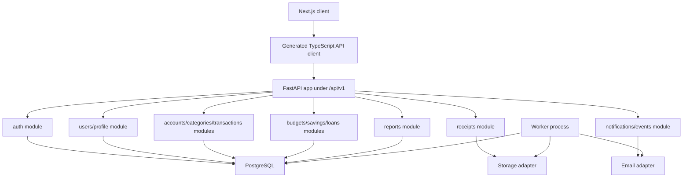
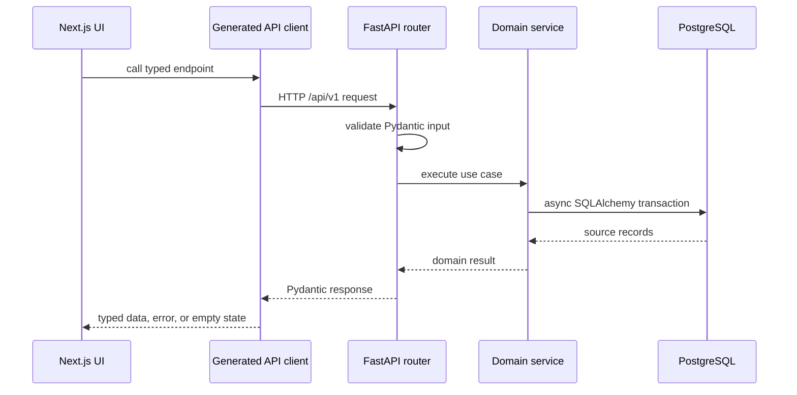
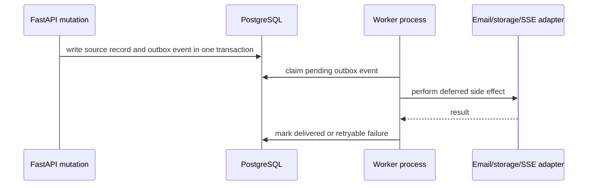
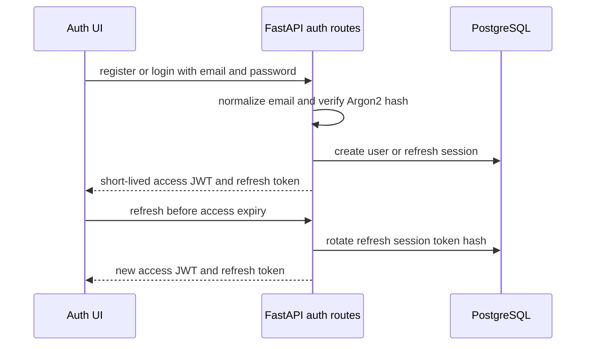
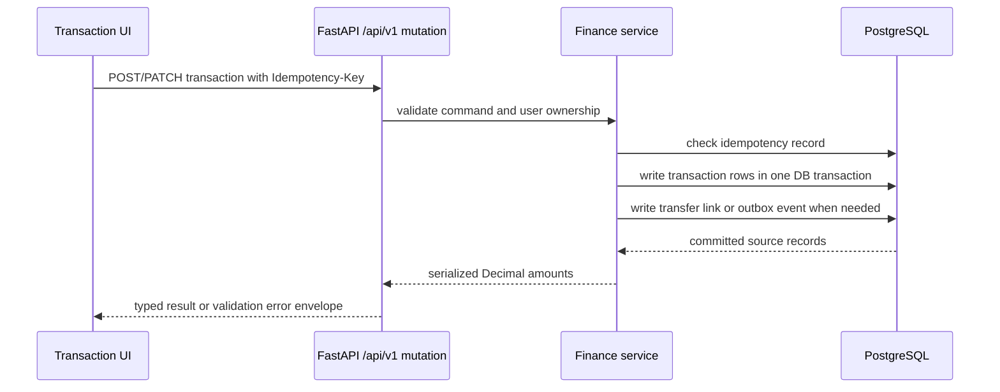
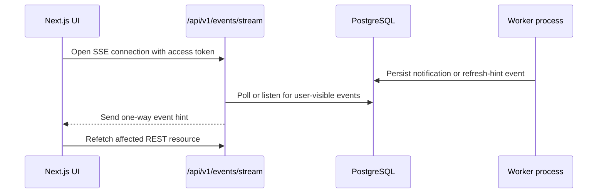
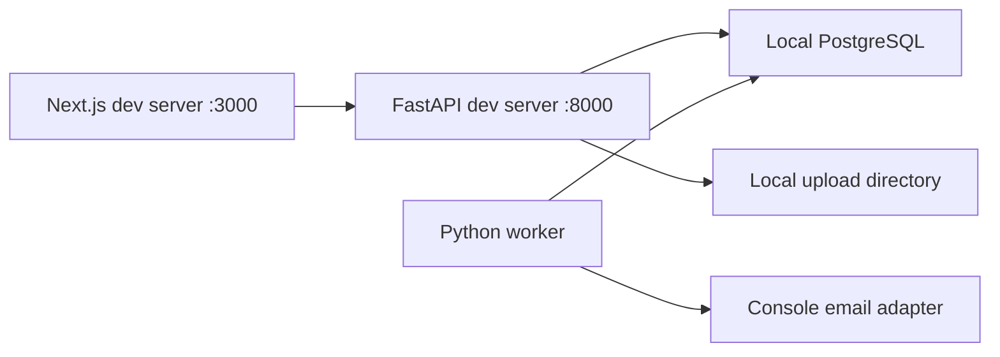
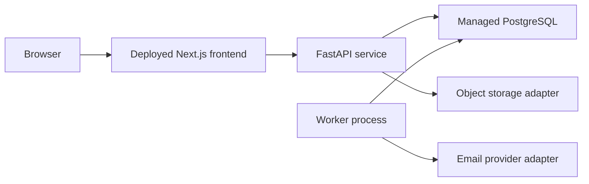

# PFM System Design

## Product Scope

PFM is a personal finance tracker for one user's income, expenses, savings goals, budgets, reports, recurring transactions, receipts, notifications, profile data, and visible loan/debt tracking. The completed Next.js UI is preserved while the existing Node backend scaffold is replaced by a Python FastAPI backend.

The backend will be a FastAPI modular monolith with PostgreSQL as the system of record, SQLAlchemy 2 async sessions for data access, Alembic for migrations, Pydantic for validation, and OpenAPI-generated TypeScript types or client code for frontend integration.

## Modular Monolith



The service remains one deployable backend with domain-oriented modules. Module boundaries are explicit, but database ownership stays inside the same PostgreSQL database to keep the product simple and transactional.

## Request Flow



Mutation routes should accept idempotency keys where retries can duplicate money-moving records. Persisted money uses PostgreSQL `NUMERIC` and Python `Decimal`; API payloads should serialize monetary amounts as decimal strings.

## Worker And Outbox Flow



Recurring transactions, notification delivery, receipt processing, and other deferred or retryable work belong in a separate worker path. Durable scheduled work should not run inside request handlers.

## Authentication Flow



Password hashing uses Argon2 through `pwdlib`. Refresh tokens are stored only as hashes and rotate on use. Password reset uses short-lived hashed reset codes or tokens delivered through the email adapter. Social login buttons visible in the current UI are not part of the MVP backend unless the user explicitly expands scope.

Current MVP auth endpoints are `POST /api/v1/auth/register`, `POST /api/v1/auth/login`, `POST /api/v1/auth/refresh`, `POST /api/v1/auth/logout`, and `GET /api/v1/users/me`. Login returns a short-lived bearer access token and an opaque refresh token in the JSON response. Protected endpoints require the access token in the `Authorization: Bearer <token>` header. Refresh and logout accept the opaque refresh token in the JSON request body until a later frontend/deployment phase defines cookie domain, SameSite, and HTTPS-only policy.

Login and registration throttling should be added before public deployment, but phase 02 has no shared rate-limit foundation yet. Do not use process-local counters because they fail across workers and deployments. A future implementation should prefer a PostgreSQL-backed throttle table keyed by endpoint, normalized email when present, client network bucket, and time window; keep responses generic so throttling cannot confirm whether an account exists. Store only throttle metadata, never raw passwords or tokens, and include `Retry-After` only when it does not create user-enumeration leakage.

## Data Ownership Boundaries

- `users` owns login identity and base user record.
- `user_profiles` owns display name, phone, occupation, about text, and avatar metadata.
- `refresh_sessions` owns refresh token rotation, revocation, and expiry.
- `password_reset_tokens` owns hashed reset codes or reset token hashes, expiry, and single-use state.
- `accounts` owns cash, bank, card, wallet, or savings containers.
- `categories` owns user and default income/expense categories.
- `transactions` owns income, expense, transfer, recurring flags, account links, category links, and notes.
- `transfer_links` owns the relationship between paired debit and credit transaction rows for account transfers.
- `idempotency_records` owns retry protection for mutation requests that may create money-moving records.
- `budgets` owns period/category limits and budget setup allocations.
- `savings_goals` and `savings_contributions` own goal targets and progress movements.
- `loan_accounts` and `loan_payments` own the visible lent/borrowed debt workflow.
- `recurring_rules` owns repeat schedules and next-run metadata.
- `receipts` owns uploaded file metadata and transaction links.
- `notifications` owns user-visible messages and read state.
- `outbox_events` owns deferred and retryable side effects.
- Audit metadata is owned by every persisted table through standard fields such as `created_at`, `updated_at`, and where relevant `deleted_at`, `created_by_user_id`, or domain-specific audit notes.

Each user-owned record must include ownership checks at the service boundary. Hard deletes should be avoided for financial records that may affect balances, audit history, or reports.

## Entity Map

| Entity | Responsibility | Key relationships and constraints |
|---|---|---|
| `users` | Authentication identity and ownership root | Unique normalized email; stores only password hashes; owns all user-scoped records. |
| `user_profiles` | Editable profile fields and avatar metadata | One profile per user; avatar points to storage metadata rather than raw file bytes. |
| `refresh_sessions` | Rotated refresh sessions | Stores token hashes, expiry, revocation metadata, and user/session metadata. |
| `password_reset_tokens` | Password reset request and verification state | Stores hashed code/token, expiry, attempt count, and used timestamp. |
| `accounts` | User money containers | Currency recorded; balances reproducible from source records; referenced accounts are archived rather than destructively removed. |
| `categories` | Income and expense categorization | Includes type/kind, icon key, default/user-owned flag, and archive state. |
| `transactions` | Income, expenses, and transfer rows | Uses `NUMERIC`/`Decimal`; links user, account, optional category, optional transfer link, optional recurring rule, and optional receipt. |
| `transfer_links` | Paired transfer grouping | Connects the two transaction rows that represent one transfer and must be written transactionally. |
| `idempotency_records` | Retry protection | Unique by user, route/action, and idempotency key; records request hash and response summary for safe replay. |
| `budgets` | Period/category spending limits | Unique by user, period, and category where active; progress is computed from transactions. |
| `savings_goals` | Goal target and status | Stores target amount/date, status, monthly target, and user ownership. |
| `savings_contributions` | Goal progress movements | Links user and goal; optionally links a transaction; supports audit-safe reversal rather than silent deletion. |
| `loan_accounts` | Lent/borrowed personal debt records | Stores type, counterparty, principal/current amount, dates, and optional phone. |
| `loan_payments` | Repayments against loan/debt records | Links loan and user; optional transaction link; amount uses decimal storage. |
| `recurring_rules` | Repeat schedules | Stores cadence, timezone, next-run time, active state, and template metadata. |
| `outbox_events` | Durable side effects | Stores event type, payload, status, attempts, next attempt, and idempotent consumer metadata. |
| `notifications` | User-visible messages | Links optional outbox/source record; stores read state and delivery state. |
| `receipts` | Uploaded receipt metadata | Stores storage key, content type, size, checksum, and optional transaction link. |
| Audit metadata | Traceability across records | Standard timestamp/user/archive fields on tables that need ownership and history. |

## Finance Core Schema

Milestone 03.1 implements the source-of-truth finance tables without exposing CRUD endpoints yet.

- `accounts` stores user-owned money containers with a three-letter currency code, non-negative `NUMERIC(18,4)` opening balance, archive fields, and user/name/archive indexes.
- `categories` stores user-owned income and expense categories with compatible icon keys, archive fields, unique names per user/kind, and user/kind indexes.
- `transactions` stores positive `NUMERIC(18,4)` source rows with explicit types: `income`, `expense`, `transfer_debit`, and `transfer_credit`. Amounts are always positive; the type determines balance direction. Rows link to the owning user, one account, an optional category, UTC-aware transaction time, optional description, and optional void timestamp.
- `transfer_links` stores one auditable linkage row for each transfer and references exactly one debit transaction row and one credit transaction row. Both sides are unique so a transaction cannot belong to multiple transfers.
- `idempotency_records` stores retry protection by user, operation, idempotency key, request hash, optional response status/body, lock expiry, and record expiry.

Finance ownership is enforced in the database as well as at future service boundaries. Account, category, transaction, and transfer references use composite foreign keys containing `user_id` where cross-user links would otherwise be possible.

Phase 03.4 exposes transfers as an auditable API representation over paired source records. A transfer creates one positive `transfer_debit` row against the source account, one positive `transfer_credit` row against the destination account, and one `transfer_links` row connecting both sides. The service rejects same-account transfers, inactive or cross-user accounts, invalid amounts, timezone-naive dates, and currency mismatches because MVP balance math does not perform currency conversion.

## API Groups And Conventions

Route groups are versioned under `/api/v1` from the first backend milestone:

```text
/api/v1/health
/api/v1/ready
/api/v1/auth/*
/api/v1/users/me
/api/v1/accounts/*
/api/v1/categories/*
/api/v1/transactions/*
/api/v1/budgets/*
/api/v1/savings-goals/*
/api/v1/loans/*
/api/v1/reports/*
/api/v1/recurring-rules/*
/api/v1/notifications/*
/api/v1/events/stream
```

List endpoints should use cursor pagination for user-facing lists that can grow, including transactions, savings goals, loans, notifications, and recurring rules. Responses should use a stable envelope with `items`, `next_cursor`, and `has_more`. Small bounded lookups such as category selectors can return arrays without pagination until growth requires it.

Errors should use one consistent JSON envelope:

```json
{
  "error": {
    "code": "validation_error",
    "message": "Human-readable summary",
    "details": []
  }
}
```

Validation errors should include field-level details. Authentication failures must not reveal whether a user email exists. Mutation routes that create transactions, transfers, savings contributions, loan payments, or recurring side effects should accept an `Idempotency-Key` header.

Money values are persisted as PostgreSQL `NUMERIC`, represented in Python as `Decimal`, and serialized in API responses as decimal strings. Timestamps are stored in UTC and serialized as ISO 8601 strings with timezone information. User-facing date grouping and recurring schedule interpretation should use explicit user timezone settings when added; until then, UTC storage remains the source of truth.

FastAPI's OpenAPI schema is the contract source. Milestone 08 should generate TypeScript types or a typed client from the OpenAPI schema and add a drift check so frontend request/response types are not manually duplicated.

Auth request/response schemas in OpenAPI intentionally expose token fields only on login and refresh responses and refresh/logout request bodies. Error responses follow the shared envelope and redact validation input for password and token fields.

## Transaction Flow



Transfers must be atomic: both sides of the transfer and the transfer linkage commit together or roll back together. A failed link write after transaction rows are flushed must leave no half-transfer rows behind. Balances and reports should be reproducible from the committed source records rather than separately trusted mutable counters.

## SSE Flow



SSE is for one-way notifications and refresh hints only. The client should refetch REST resources after receiving a hint. WebSockets remain out of scope until a concrete bidirectional requirement exists.

## Deployment Topology

### Local



Local development should work without third-party credentials. `.env.example` will define required values as backend milestones add them.

### Production



Production hosting remains portable until the deployment milestone. The API base URL, CORS origins, database URL, JWT secret, storage backend, and email backend are environment configured.

## Explicit Non-goals

- Do not redesign the current Next.js UI.
- Do not add bank aggregation, payment processing, investment trading, AI features, organizations, or mobile apps.
- Do not introduce microservices, GraphQL, Redis, or WebSockets without a proven requirement.
- Do not request cloud storage, SMTP, OAuth, or deployment credentials before the milestone that needs them.
- Do not implement FastAPI or database migrations in milestone 00.
- Do not implement multi-currency conversion in the MVP. Store one user base currency first, defaulting to `USD` until the user confirms otherwise, while keeping schema room for later currency support.
