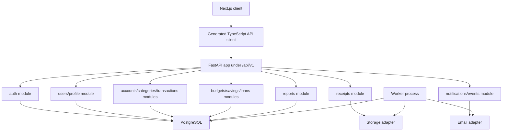
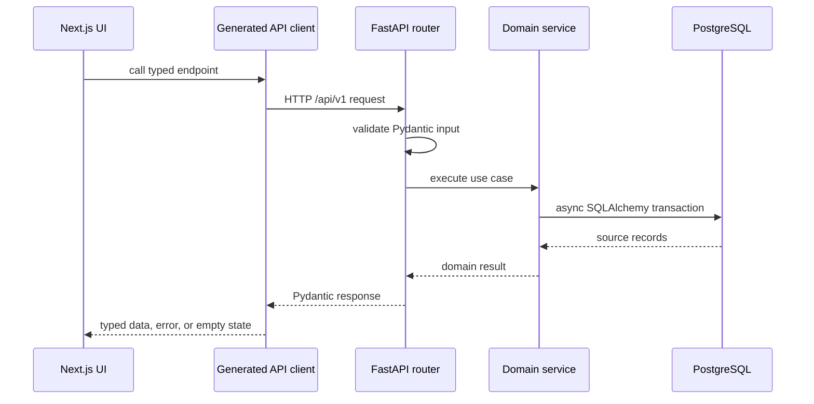
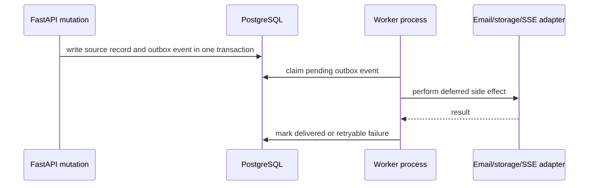
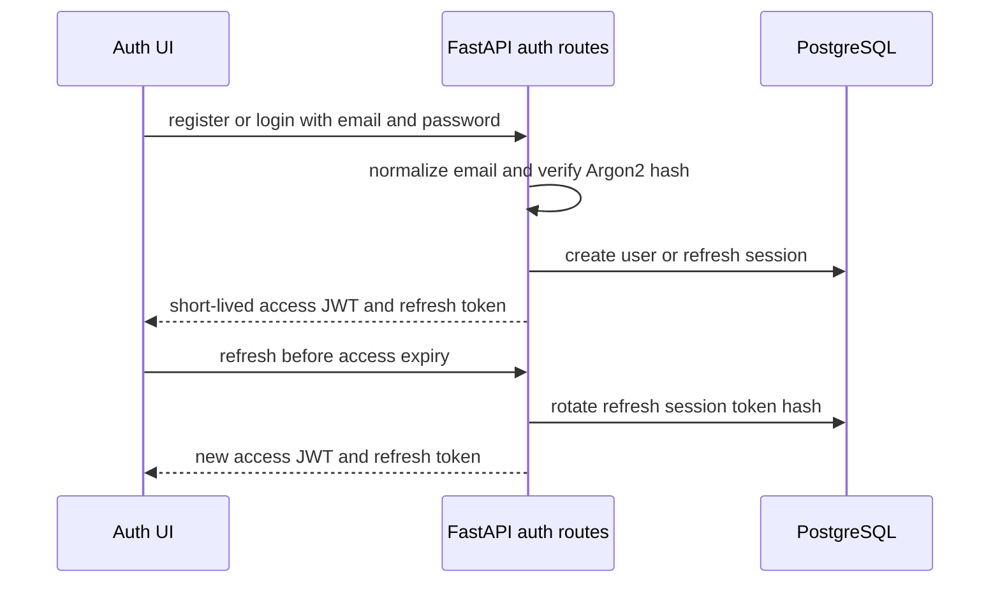
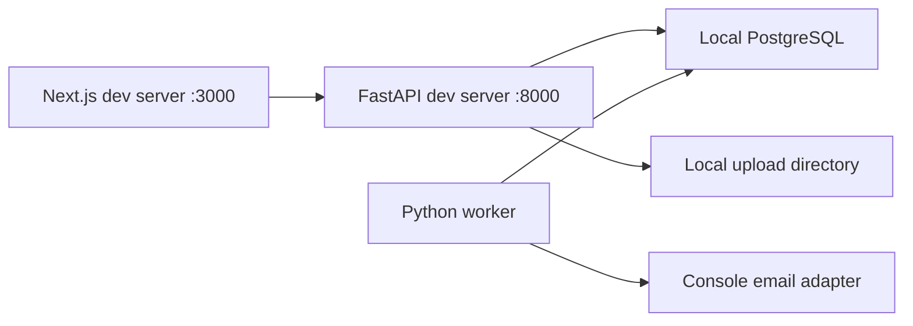
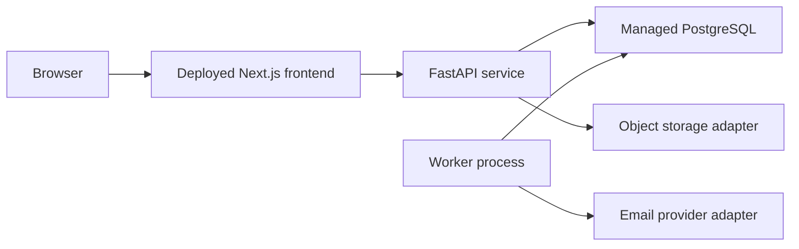

# PFM System Design

## Product Scope

PFM is a personal finance tracker for one user's income, expenses, savings goals, budgets, reports, recurring transactions, receipts, notifications, profile data, and visible loan/debt tracking. The completed Next.js UI is preserved while the existing Node backend scaffold is replaced by a Python FastAPI backend.

The backend will be a FastAPI modular monolith with PostgreSQL as the system of record, SQLAlchemy 2 async sessions for data access, Alembic for migrations, Pydantic for validation, and OpenAPI-generated TypeScript types or client code for frontend integration.

## Modular Monolith

The service remains one deployable backend with domain-oriented modules. Module boundaries are explicit, but database ownership stays inside the same PostgreSQL database to keep the product simple and transactional.

## Request Flow

Mutation routes should accept idempotency keys where retries can duplicate money-moving records. Persisted money uses PostgreSQL `NUMERIC` and Python `Decimal`; API payloads should serialize monetary amounts as decimal strings.

## Worker And Outbox Flow

Recurring transactions, notification delivery, receipt processing, and other deferred or retryable work belong in a separate worker path. Durable scheduled work should not run inside request handlers.

## Authentication Flow

Password hashing uses Argon2 through `pwdlib`. Refresh tokens are stored only as hashes and rotate on use. Password reset uses short-lived hashed reset codes or tokens delivered through the email adapter. Social login buttons visible in the current UI are not part of the MVP backend unless the user explicitly expands scope.

## Data Ownership Boundaries

- `users` owns login identity and base user record.
- `user_profiles` owns display name, phone, occupation, about text, and avatar metadata.
- `refresh_sessions` owns refresh token rotation, revocation, and expiry.
- `accounts` owns cash, bank, card, wallet, or savings containers.
- `categories` owns user and default income/expense categories.
- `transactions` owns income, expense, transfer, recurring flags, account links, category links, and notes.
- `budgets` owns period/category limits and budget setup allocations.
- `savings_goals` and `savings_contributions` own goal targets and progress movements.
- `loan_accounts` and `loan_payments` own the visible lent/borrowed debt workflow.
- `recurring_rules` owns repeat schedules and next-run metadata.
- `receipts` owns uploaded file metadata and transaction links.
- `notifications` owns user-visible messages and read state.
- `outbox_events` owns deferred and retryable side effects.

Each user-owned record must include ownership checks at the service boundary. Hard deletes should be avoided for financial records that may affect balances, audit history, or reports.

## Deployment Topology

### Local

Local development should work without third-party credentials. `.env.example` will define required values as backend milestones add them.

### Production

Production hosting remains portable until the deployment milestone. The API base URL, CORS origins, database URL, JWT secret, storage backend, and email backend are environment configured.

## Explicit Non-goals

- Do not redesign the current Next.js UI.
- Do not add bank aggregation, payment processing, investment trading, AI features, organizations, or mobile apps.
- Do not introduce microservices, GraphQL, Redis, or WebSockets without a proven requirement.
- Do not request cloud storage, SMTP, OAuth, or deployment credentials before the milestone that needs them.
- Do not implement FastAPI or database migrations in milestone 00.
